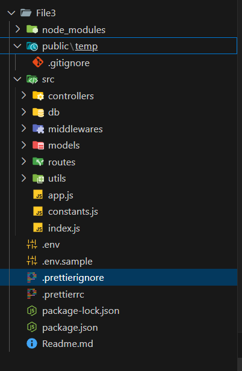

# Backend
.gitignore - https://mrkandreev.name/snippets/gitignore-generator/ 

cd src -> ls -> touch app.js constants.js index.js

npm init  || or npm init -y

package name: (file3)
version: (1.0.0)
description: a backend at - youtube
entry point: (index.js)
test command:
git repository:
keywords: backens, js, youtube, reja
author: nasim
license: (ISC)
About to write to C:\Users\User\Desktop\Backend\File3\package.json:

{
  "name": "file3",
  "version": "1.0.0",
  "description": "a backend at - youtube",
  "main": "index.js",
  "scripts": {
    "test": "echo \"Error: no test specified\" && exit 1"
  },
  "keywords": [
    "backens",
    "js",
    "youtube",
license: (ISC)
About to write to C:\Users\User\Desktop\Backend\File3\package.json:

{
  "name": "file3",
  "version": "1.0.0",
  "description": "a backend at - youtube",
  "main": "index.js",
  "scripts": {
    "test": "echo \"Error: no test specified\" && exit 1"
  },
  "keywords": [
    "backens",
    "js",
    "youtube",
    "reja"
  ],
  "author": "nasim",
  "license": "ISC"
}

Is this OK? (yes) y
PS C:\Users\User\Desktop\Backend\File3> ls

Mode                 LastWriteTime         Length Name
----                 -------------         ------ ----
d-----        09-04-2025     21:56                public
d-----        09-04-2025     21:55                src
-a----        09-04-2025     21:52              0 .env
-a----        09-04-2025     21:52              0 .env.sample
-a----        09-04-2025     20:39            300 package.json
-a----        09-04-2025     20:41              0 Readme.md

 
PS C:\Users\User\Desktop\Backend\File3\src> 

use "type": "module", // 2 type // use import sntax 

# use nodemon for reloding
npm i -D nodemon   
-> "scripts": {
    "dev": "nodemon src/index.js"
  },
--------
"scripts": {
    "test": "echo \"Error: no test specified\" && exit 1"
  },

  chang to test to dev

"scripts": {
    "dev": "echo \"Error: no test specified\" && exit 1"
  },

controllers -> fantionality
db -> database
middlewares -> in betuen (request full file)
models -> 
routes -> '/home'
utils ->

-- basic stracters---- end

// prettier - https://www.npmjs.com/package/prettier // for tem project 
npm i prettier
# Add prettierignore -> do not chang

// add npm i .env

<!-- // https://www.npmjs.com/package/cookie-parser  -->
<!-- https://www.npmjs.com/package/cors -->

<!-- https://nodejs.org/api/errors.html -->

<!-- https://developer.mozilla.org/en-US/docs/Web/HTTP/Reference/Status -->

https://www.npmjs.com/package/mongoose-aggregate-paginate-v2 
npm i mongoose-aggregate-paginate-v2 

Aggregation Pipeline - https://www.mongodb.com/docs/manual/core/aggregation-pipeline/

https://mongoosejs.com/docs/middleware.html#pre

https://www.npmjs.com/package/bcrypt < or bcryptjs
npm i bcrypt

https://www.npmjs.com/package/jsonwebtoken 
npm i jsonwebtoken
https://jwt.io/

🔹 1. Generate a Secure Secret Key
You need a strong random string as your ACCESS_TOKEN_SECRET. You can generate it using different methods:

✅ Method 1: Using Node.js (Recommended)
Run the following command in your terminal:

sh
Copy
Edit
node -e "console.log(require('crypto').randomBytes(64).toString('hex'))"
This will generate a 64-byte random hexadecimal string.

Example output:

Copy
Edit
4a5f8e9b12c3d6e7f8a9b0c1d2e3f4g5h6i7j8k9l0m1n2o3p4q5r6s7t8u9v0w1x2y3z4
✅ Method 2: Using OpenSSL (Linux/macOS)
Run the following command:

sh
Copy
Edit
openssl rand -hex 64
This generates a secure random string in hexadecimal format.

.............
🎯 Summary
Generate a strong secret key using crypto or openssl.

Store it in a .env file for security.

Load it in your Node.js app using dotenv.

Use it to sign & verify JWT tokens in authentication.

Let me know if you need further help! 🚀

------------
What is ACCESS_TOKEN_EXPIRY?
ACCESS_TOKEN_EXPIRY defines the expiration time of an access token in a JWT-based authentication system. It ensures that tokens are valid only for a limited period, improving security.

How to Set ACCESS_TOKEN_EXPIRY?
You can define ACCESS_TOKEN_EXPIRY in your .env file:
--
ACCESS_TOKEN_SECRET=your_generated_secret_here
ACCESS_TOKEN_EXPIRY=15m  # Token expires in 15 minutes
-----------
Common Expiry Time Formats
You can set the expiration time in various formats:

Format	Meaning
60	60 seconds (1 minute)
10m	10 minutes
1h	1 hour
2d	2 days
7d	7 days
1w	1 week
Why Use Expiry Time?
✅ Improves Security – Expired tokens prevent unauthorized long-term access.

✅ Reduces Risk – If a token is leaked, it becomes useless after expiry.

✅ Forces Re-authentication – Users must log in again after expiry.
......................
🔹 Summary
Define expiry time in .env → ACCESS_TOKEN_EXPIRY=15m

Use it in jwt.sign() → { expiresIn: process.env.ACCESS_TOKEN_EXPIRY }

Handle expired tokens properly in jwt.verify()
------------

🔹 What are REFRESH_TOKEN_SECRET and REFRESH_TOKEN_EXPIRY?
1️⃣ REFRESH_TOKEN_SECRET
This is a secret key used to sign refresh tokens.

Refresh tokens generate new access tokens without requiring the user to log in again.

2️⃣ REFRESH_TOKEN_EXPIRY
Defines the expiration time of the refresh token.

Typically, refresh tokens last longer than access tokens (e.g., 7 days, 30 days).

Unlike access tokens, refresh tokens are stored securely (e.g., in HTTP-only cookies or a database).

🔹 Setting Up in .env
Add the following in your .env file:

ini
Copy
Edit
ACCESS_TOKEN_SECRET=your_access_token_secret
ACCESS_TOKEN_EXPIRY=15m

REFRESH_TOKEN_SECRET=your_refresh_token_secret
REFRESH_TOKEN_EXPIRY=7d  # Refresh token lasts for 7 days
--------------
🔹 Why Use Refresh Tokens?
Feature	Access Token	Refresh Token
Expiry	Short (e.g., 15m)	Long (e.g., 7d)
Storage	Frontend (in memory)	Secure storage (cookie/database)
Used For	API Authorization	Getting a new access token
Security Risk	Higher (if leaked)	Lower (stored securely)
🔹 Summary
Access tokens expire quickly (15m), refresh tokens last longer (7d).

Store refresh tokens securely (HTTP-only cookies or database).

When the access token expires, use the refresh token to get a new one.

Always verify refresh tokens before issuing new access tokens.
--------------------------------------------------

https://www.npmjs.com/package/express-fileupload 
https://www.npmjs.com/package/multer
https://nodejs.org/api/fs.html
https://nodejs.org/api/fs.html#fspromisesunlinkpath
https://console.cloudinary.com/pm/c-4bf58e5be22f5e07ffeae81de3a58d/getting-started
