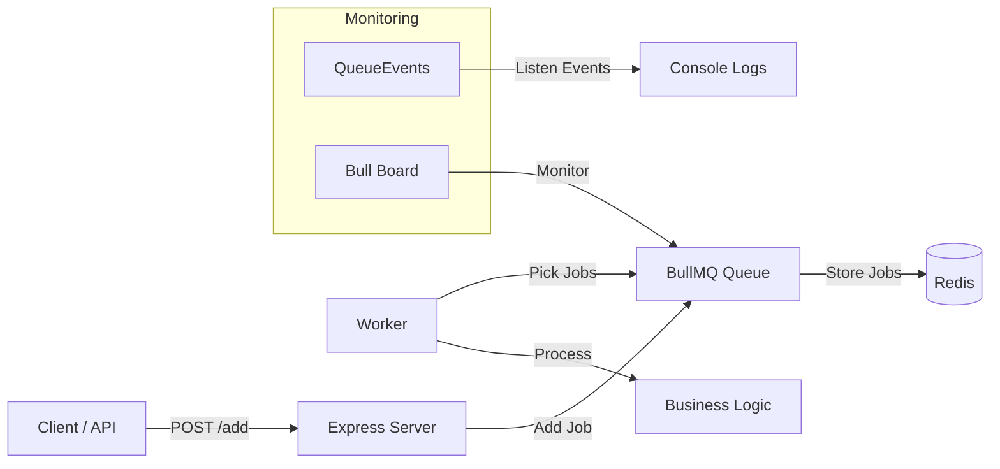

# BullMQ Advanced Learning Project

A complete, production-style implementation of **BullMQ** with Redis, Express, and Bull Board Dashboard.

---

## 🎯 What I Am Learning Here

This project helps me understand modern **background job processing** in Node.js using BullMQ — one of the most popular and powerful queue libraries.

### Key Learning Outcomes

| Area                        | What I'm Learning                                                                 | Why It Matters |
|----------------------------|------------------------------------------------------------------------------------|--------------|
| Message Queues             | Producer-Consumer architecture                                                     | Decouple slow tasks from API |
| BullMQ Core Components     | Queue, Job, Worker, QueueEvents                                                    | Core building blocks |
| Redis Integration          | Using `ioredis` with proper connection handling                                    | Reliable & scalable storage |
| Real-time Monitoring       | Bull Board Dashboard + QueueEvents listeners                                       | Production observability |
| Advanced Job Patterns      | Delay, Retry, Priority, Repeatable, Bulk, Progress                                 | Real-world use cases |
| Project Architecture       | Modular structure (`config/`, `queue/`, separate server & worker)                  | Clean & maintainable code |
| Graceful Handling          | Error handling, retries, failed jobs, graceful shutdown                            | Robust applications |

---

## 📊 System Architecture Diagram



---

## 📁 Project Structure

```bash
bullmq-project/
├── config/
│   └── redis.js                 # Redis connection using ioredis
├── queue/
│   └── myQueue.js               # Queue instance
├── worker.js                    # Job processor
├── events.js                    # QueueEvents listeners
├── server.js                    # Express + Bull Board
├── stats.js                     # Queue statistics
├── .env
└── README.md


---

## 🛠️ Core Components Explained (Line by Line)

### 1. Redis Configuration (`config/redis.js`)

```js
import "dotenv/config";
import IORedis from "ioredis";

const redisUrl = process.env.REDIS_URL || "redis://127.0.0.1:6379";

export const connection = new IORedis(redisUrl, {
  maxRetriesPerRequest: null,     // Important for BullMQ
});

connection.on("error", (err) => console.error("Redis Error:", err));
connection.on("connect", () => console.log("Redis connected successfully!"));
```

**Explanation**:  
- Loads environment variables  
- Creates a reusable Redis connection using `ioredis` (better than default)  
- Handles connection events for debugging

### 2. Queue (`queue/myQueue.js`)

```js
import { Queue } from "bullmq";
import { connection } from "../config/redis.js";

export const myQueue = new Queue("test-queue", { connection });
```

**Explanation**:  
Creates a named queue (`test-queue`) that uses the shared Redis connection.

### 3. Worker (`worker.js`)

```js
const worker = new Worker("test-queue", async (job) => {
  console.log("⚙️ Processing:", job.name, job.data);

  if (job.name === "fail-job") throw new Error("Intentional failure");

  await job.updateProgress(50);           // Update progress
  await new Promise(r => setTimeout(r, 2000));
  await job.updateProgress(100);

  return "Done";                          // Return value available in 'completed' event
}, {
  connection,
  concurrency: 2                          // Process 2 jobs simultaneously
});
```

**Explanation**:
- Worker listens to `test-queue`
- Processes each job asynchronously
- Supports progress tracking and error simulation
- `concurrency: 2` allows parallel processing

### 4. QueueEvents (`events.js`)

```js
const queueEvents = new QueueEvents("test-queue", { connection });

queueEvents.on("waiting", ({ jobId }) => console.log(`⏳ Job waiting: ${jobId}`));
queueEvents.on("active", ({ jobId }) => console.log(`▶️ Job started: ${jobId}`));
queueEvents.on("completed", ({ jobId, returnvalue }) => 
  console.log(`🎉 Job ${jobId} completed:`, returnvalue));
```

**Explanation**: Global event listener for all job lifecycle events.

---

## 📋 Job Patterns Used in This Project

| Endpoint          | Job Type             | Features Used                     | Purpose |
|-------------------|----------------------|-----------------------------------|--------|
| `/add`            | Normal Job           | Basic add                         | Standard background task |
| `/delay`          | Delayed Job          | `delay: 3000`                     | Scheduled execution |
| `/retry`          | Retry Job            | `attempts: 3`                     | Fault tolerance |
| `/add-bulk`       | Bulk Jobs            | `addBulk()`                       | High volume jobs |
| `/priority`       | Prioritized Job      | `priority: 1`                     | Urgent tasks |
| `/repeat`         | Repeatable Job       | `repeat: { every: 10000 }`        | Cron-like scheduling |

---

## 🚀 How to Run

1. Start Redis:
   ```bash
   redis-server
   ```

2. Install dependencies:
   ```bash
   npm install
   ```

3. Run all components:
   - Worker: `node worker.js`
   - Events: `node events.js`
   - Stats: `node stats.js`
   - Server: `node server.js`

4. Open Dashboard:
   → http://localhost:4000/admin/queues

---

## 📊 What You Can Test

- Add single & bulk jobs
- Observe delay, priority, and retry behavior
- Watch real-time updates in Bull Board
- Simulate failures and see retry logic
- Monitor queue statistics

---


