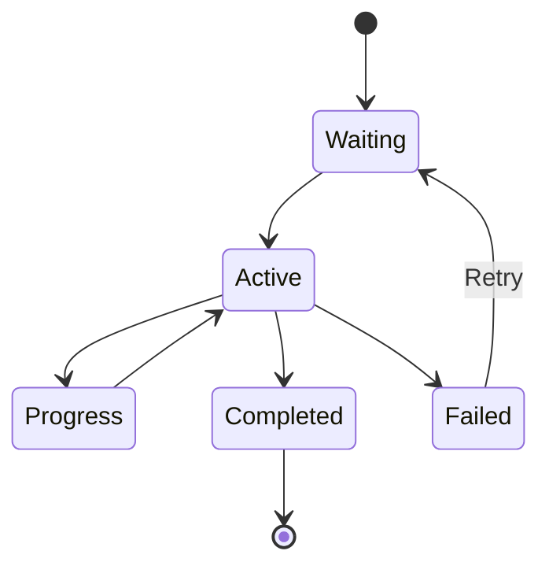

# BullMQ Mastery: Theory & Implementation

A comprehensive learning project focused on understanding **Message Queues** and **BullMQ** in depth.

---

## 🎯 What I Am Learning Here (Theory Focus)

This project is designed to build strong theoretical and practical understanding of **background job processing systems**.

### Core Theoretical Concepts

| Concept                      | Theory Explanation                                                                 | Why It Matters |
|-----------------------------|------------------------------------------------------------------------------------|--------------|
| **Message Queue**           | A buffer that holds tasks (jobs) to be processed asynchronously                    | Prevents blocking of main thread |
| **Producer-Consumer Pattern** | Producers add jobs, Consumers (Workers) process them                               | Decoupling & Scalability |
| **BullMQ**                  | Modern, Redis-backed queue library for Node.js with advanced features              | Reliable, feature-rich job management |
| **Redis Role**              | Acts as persistent storage for jobs, states, and events                            | Durability and speed |
| **Event-Driven Architecture** | System reacts to job lifecycle events (waiting, active, completed, failed)        | Real-time observability |
| **Job Lifecycle**           | waiting → active → progress → completed/failed                                     | Predictable processing flow |

---

## 🏗️ System Architecture (Improved Mermaid Chart)

```mermaid
flowchart TB
    subgraph Client
        A[API Client / Frontend]
    end

    subgraph "Express API Layer"
        B[Express Server]
        C[REST Endpoints]
    end

    subgraph "BullMQ Core"
        D[Queue<br/>test-queue]
        E[Job]
        F[Worker<br/>concurrency: 2]
    end

    subgraph "Storage"
        G[(Redis<br/>via ioredis)]
    end

    subgraph "Monitoring Layer"
        H[Bull Board Dashboard]
        I[QueueEvents Listener]
        J[Stats Logger]
    end

    A -->|HTTP Request| C
    C -->|queue.add()| D
    D <-->|Store & Retrieve| G
    F -->|Dequeue & Process| D
    F -->|updateProgress()| E
    E -->|Lifecycle Events| I
    D -->|Monitor| H
    I -->|Events| Console[Console Logs]

    style D fill:#22c55e,stroke:#166534,color:white
    style G fill:#3b82f6,stroke:#1e40af,color:white
    style H fill:#eab308,stroke:#854d0e
```

---

## 📖 Deep Theory Explanation

### 1. What is a Message Queue?

A **Message Queue** is a software component that enables asynchronous communication between different parts of a system. Instead of executing tasks immediately (synchronously), tasks are placed in a queue and processed later by workers.

**Benefits**:
- Improved responsiveness (API returns fast)
- Better resource utilization
- Fault tolerance & retry mechanisms
- Scalability (multiple workers)

### 2. BullMQ Architecture

BullMQ consists of four main components:

- **Queue**: The interface to add jobs. Acts as the **Producer**.
- **Job**: A single unit of work containing `name`, `data`, and metadata.
- **Worker**: The **Consumer** that picks jobs from the queue and executes them.
- **QueueEvents**: Global event emitter for job lifecycle events.

All components communicate through **Redis**, which stores:
- Job data
- Job state (waiting, active, completed, failed)
- Repeat patterns
- Progress information

### 3. Job Lifecycle in BullMQ



---

## 📋 Code Components Explained (Theory + Code)

### 1. Redis Connection (`config/redis.js`)

**Theory**: Using a dedicated Redis client (`ioredis`) allows better control over connections, retries, and events.

```js
export const connection = new IORedis(redisUrl, {
  maxRetriesPerRequest: null,   // Critical for BullMQ to work properly
});
```

### 2. Queue & Worker

**Theory**: The Queue is just a **facade**. The real work happens in the Worker. Concurrency controls how many jobs run in parallel.

```js
const worker = new Worker("test-queue", async (job) => {
  await job.updateProgress(50);   // Theory: Progress is stored in Redis
  // ... processing logic
}, {
  concurrency: 2                  // Theory: Controls throughput
});
```

### 3. QueueEvents

**Theory**: This is the **Observer Pattern** in action. Instead of polling, we listen to events emitted by BullMQ.

---

## 📊 Job Patterns & Their Theoretical Purpose

| Pattern           | BullMQ Feature                  | Theoretical Purpose                     | Example Use Case |
|-------------------|---------------------------------|-----------------------------------------|------------------|
| Normal            | `queue.add()`                   | Basic async task                        | Send email |
| Delayed           | `{ delay: ms }`                 | Time-based scheduling                   | Reminder after 1 hour |
| Retry             | `{ attempts: n }`               | Fault tolerance                         | External API calls |
| Priority          | `{ priority: number }`          | Ordered execution                       | Urgent notifications |
| Repeatable        | `{ repeat: { every/cron } }`    | Periodic tasks                          | Daily reports |
| Bulk              | `addBulk()`                     | Efficient batch processing              | Mass notifications |
| Progress          | `job.updateProgress()`          | Long-running task feedback              | File processing |

---

## 🚀 How to Run

1. Start Redis server
2. Run in separate terminals:
   - `node worker.js`
   - `node events.js`
   - `node stats.js`
   - `node server.js`

3. Access:
   - API Server: `http://localhost:3000`
   - Dashboard: `http://localhost:4000/admin/queues`

---
