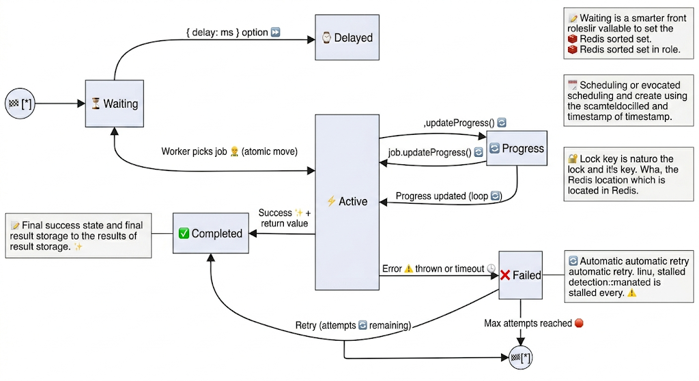

## 📖 Deep Dive: BullMQ Job Lifecycle (Production-Level Theory)

Understanding the **Job Lifecycle** is the single most important concept when mastering BullMQ. Every job follows a strict, atomic state machine managed entirely inside Redis. This design gives BullMQ its reliability, observability, and fault-tolerance.

### Enhanced Job Lifecycle State Diagram



```mermaid
stateDiagram-v2
    direction LR
    
    [*] --> Waiting
    
    Waiting --> Delayed : { delay: ms } option
    Waiting --> Active : Worker picks job (atomic move)
    
    Active --> Progress : job.updateProgress()
    Progress --> Active : Progress updated (loop)
    
    Active --> Completed : Success + return value
    Active --> Failed : Error thrown or timeout
    
    Failed --> Waiting : Retry (attempts remaining)
    Failed --> [*] : Max attempts reached
    
    note right of Waiting
        Most common state.
        Stored in Redis sorted set: "bull:test-queue:waiting"
    end
    
    note right of Delayed
        Time-based scheduling.
        Stored in delayed sorted set with score = timestamp
    end
    
    note right of Active
        Worker has acquired a lock.
        Job moved to "bull:test-queue:active"
        Lock key: "bull:test-queue:lock:{jobId}"
    end
    
    note right of Failed
        Automatic retry with backoff.
        Error + stack stored in Redis.
        Stalled detection also moves here.
    end
    
    note left of Completed
        Final success state.
        Result stored for later retrieval.
    end
```

### Extremely Detailed State Breakdown

| State       | Internal Redis Representation                                      | What BullMQ Does Internally                                                                 | What You Can Do / Observe in Code                                                                 | Common Triggers |
|-------------|--------------------------------------------------------------------|---------------------------------------------------------------------------------------------|---------------------------------------------------------------------------------------------------|-----------------|
| **Waiting** | Sorted Set: `bull:{queueName}:waiting`                             | Job is added with score = `Date.now()`                                                     | `queue.getWaiting()`<br/>`queueEvents.on('waiting')`                                             | `queue.add()` |
| **Delayed** | Sorted Set: `bull:{queueName}:delayed` (score = future timestamp) | Job is moved from waiting to delayed set                                                   | `queue.getDelayed()`<br/>`queueEvents.on('delayed')`                                             | `{ delay: 5000 }` |
| **Active**  | List: `bull:{queueName}:active`<br/>Lock key: `bull:{queueName}:lock:{jobId}` | Worker atomically moves job + acquires lock (prevents double processing)                   | `queue.getActive()`<br/>`queueEvents.on('active')`<br/>`job.isActive()`                           | Worker picks job |
| **Progress**| Hash field inside job key                                          | Progress % is stored in Redis and broadcast via events                                     | `job.updateProgress(75)`<br/>`queueEvents.on('progress')`                                        | Long-running jobs |
| **Completed**| List: `bull:{queueName}:completed`                                 | Job moved here, `returnvalue` stored in job hash                                           | `queue.getCompleted()`<br/>`queueEvents.on('completed', ({returnvalue}) => ...)`                  | Success |
| **Failed**  | List: `bull:{queueName}:failed`                                    | Error + stack trace stored. If retries left → back to Waiting                             | `queue.getFailed()`<br/>`queueEvents.on('failed')`                                               | Exception thrown |

### Advanced Lifecycle Concepts (Very Deep Theory)

1. **Atomic Moves & Redis Transactions**  
   All state transitions are done with **Redis multi/exec** or Lua scripts → **guaranteed atomicity**. Even if your Node.js process crashes mid-transition, the job state remains consistent.

2. **Job Locking Mechanism**  
   - When a worker picks a job, it creates a temporary lock key with TTL.
   - If the worker dies (crash, restart, container killed), the lock expires → BullMQ detects it as **stalled**.
   - Stalled jobs are automatically moved back to `waiting` for retry.

3. **Stalled Jobs (Hidden but Critical State)**  
   - Default stall interval = 30 seconds.
   - If a job stays in `active` longer than this without progress or completion → it is considered stalled.
   - You can listen to it: `queueEvents.on('stalled', ...)`

4. **Retry Logic (Backoff Strategies)**  
   - Controlled by `{ attempts: N, backoff: { type: 'exponential', delay: 1000 } }`
   - After each failure, job goes back to `waiting` with increased delay.
   - After max attempts → permanently `failed`.

5. **Job Data Persistence**  
   Every job is stored as a **Redis Hash** with key: `bull:{queueName}:{jobId}`  
   Fields include: `name`, `data`, `opts`, `progress`, `returnvalue`, `failedReason`, `stacktrace`, `attemptsMade`, etc.

---

### How You Observe the Full Lifecycle in Your Current Code

```js
// events.js (QueueEvents)
queueEvents.on("waiting",   ({ jobId }) => console.log(`⏳ [Waiting]   Job ${jobId}`));
queueEvents.on("active",    ({ jobId }) => console.log(`▶️  [Active]    Job ${jobId}`));
queueEvents.on("progress",  ({ jobId, data }) => console.log(`📊 [Progress]  Job ${jobId} → ${data}%`));
queueEvents.on("completed", ({ jobId, returnvalue }) => console.log(`✅ [Completed] Job ${jobId} →`, returnvalue));
queueEvents.on("failed",    ({ jobId, failedReason }) => console.log(`💥 [Failed]    Job ${jobId} →`, failedReason));
```

---