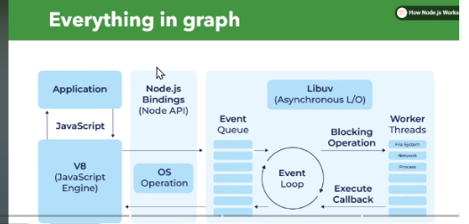

# ⭐ **How Node.js Works: V8 Engine, Event Loop & Worker Threads**

# 🌍 **Node.js Architecture in One Line**

**Node.js = JavaScript on the server powered by V8 + Non-blocking I/O using Event Loop + True multithreading using Worker Threads.**

---

# 🔥 **1. V8 Engine – The Heart of Node.js**

### ✔ What is V8?

* A high-performance JavaScript engine developed by Google for Chrome.
* Written in C++.
* Embedded inside Node.js.

### ✔ What V8 does:

1. Reads your JavaScript code
2. Converts it to machine code
3. Executes it extremely fast (JIT compilation)

### ✔ Why V8 makes Node.js fast:

* Just-In-Time (JIT) compiler
* Garbage collector
* Modern JS support (ES6+)

👉 **Think of V8 as the "engine" that runs your JavaScript.**

---

# ⚙️ **2. Event Loop – The Brain of Node.js**

Node.js runs JavaScript in **a single thread**, BUT it handles thousands of requests by **not blocking**.

This magic happens because of the **Event Loop**.

---

## 🎬 **How it works (simple story)**

📍 Step 1: Your JS code runs on the main thread
📍 Step 2: If the code is slow (file read, DB query, network call), Node.js doesn’t wait
📍 Step 3: It gives the task to **libuv thread pool**
📍 Step 4: Thread pool finishes
📍 Step 5: Event Loop picks up the callback and continues execution

---

## 🎯 **Event Loop = Super-efficient task manager**

It has phases:

| Phase                 | What happens            |
| --------------------- | ----------------------- |
| **Timers**            | setTimeout, setInterval |
| **Pending Callbacks** | I/O results             |
| **Idle/Prepare**      | Internal work           |
| **Poll**              | Waiting for new events  |
| **Check**             | setImmediate callbacks  |
| **Close callbacks**   | Cleanup                 |

👉 **This is why Node.js handles 10,000+ clients without lag.**
👉 **It never blocks. It delegates tasks.**

---

# 🧵 **3. Worker Threads – Real Multithreading**

Event Loop handles I/O extremely well, but **CPU-heavy tasks block the main thread**, such as:

* bcrypt hashing
* image/video compression
* JSON parsing of huge data
* ML computations
* Big loops

For this, Node.js provides **Worker Threads**.

### ✔ What Worker Threads allow?

* Run JavaScript in a separate thread
* Share memory (SharedArrayBuffer)
* Perform CPU-heavy tasks without freezing the main thread

---

# 💡 **Simple architecture diagram**

```
            ┌──────────────┐
            │  V8 ENGINE   │  ← Executes JS
            └──────┬───────┘
                   │
                   ▼
          ┌──────────────────┐
          │   EVENT LOOP     │ ← Brain (non-blocking)
          └───┬────────┬────┘
              │        │
   ┌──────────▼─┐  ┌───▼────────┐
   │ libuv I/O  │  │ Worker      │
   │ Threadpool │  │ Threads     │
   └────────────┘  └─────────────┘
```

---

# 🥇 **5-Line Perfect Interview Answer**

**Node.js runs JavaScript using the V8 engine, which compiles JS to fast machine code.
It uses a single thread to run JS, but handles async work using the Event Loop, making I/O operations non-blocking.
Heavy tasks like file I/O, crypto, DNS, etc., are executed in the libuv thread pool.
For CPU-heavy JavaScript tasks, Node provides Worker Threads for actual multithreading.
Together, V8 + Event Loop + Workers make Node fast, scalable, and efficient.**

---

# 🚀 Want an even better version?


---

# 🚀 How Node.js Works (Explained Using the Diagram You Shared)

diagram shows **three major parts**:

---

# ✅ **1. JavaScript Side (V8 Engine + Your Application)**

### **📌 Application**

This is your JS code:

```js
fs.readFile()
setTimeout()
console.log()
```

### **📌 V8 Engine**

* Runs your JavaScript.
* Handles **synchronous** tasks.
* Cannot handle I/O (file, network).
* Only executes *non-blocking* JS.

V8 → sends tasks it cannot do to Node.js internals.

---

# ✅ **2. Node.js Bindings + OS Operations**

### **📌 Node.js Bindings (Node API / C++ Bindings)**

These are the “bridges” between JavaScript and the OS.

Example:

* JS → `fs.readFile()`
* Node Bindings → convert into C++ → send to libuv

### **📌 OS Operations**

If the OS can perform something fast (like networking), it handles it directly.

Example:

* DNS lookup
* File metadata

---

# ✅ **3. libuv (Async I/O Engine) + Event Loop + Worker Threads**

This is the *heart* of Node.js.

---

## 🔁 **Event Loop**

Controls how callbacks are executed.

It checks:

### **📌 Event Queue**

Are any callbacks ready?
If yes → Event Loop runs them in JS thread.

---

## ⚙️ **libuv – Asynchronous I/O Layer**

Handles tasks not handled by V8:

* File system operations
* Network operations
* Timers
* Thread pool tasks

---

## 🧵 **Worker Threads / Thread Pool**

If a task is *blocking*, libuv sends it to worker threads:

* File I/O
* Crypto operations (hash, bcrypt)
* Compression
* CPU-heavy tasks

These threads finish work → send results back → event loop runs the callback.

---

# 🎯 Flow Summary (Exactly as in Your Graph)

1. **Your App (JavaScript)** runs in V8
2. V8 forwards I/O tasks → **Node.js Bindings**
3. Bindings give tasks → **libuv**
4. libuv decides:

   * Can OS handle directly? ➜ OS
   * Is it slow/blocking? ➜ Worker Threads
5. When operations finish:

   * They send results → **Event Queue**
6. **Event Loop** takes callback → V8 executes it
7. Your JS code continues running

---

# 📌 Why Node.js Is Fast?

* Only **one JS thread** → no overhead
* Heavy work is pushed to libuv + worker threads
* Event loop never blocks
* Perfect for:

  * APIs
  * Realtime apps
  * Socket servers
  * Microservices

Not good for:

* Heavy CPU tasks (use worker_threads module)

