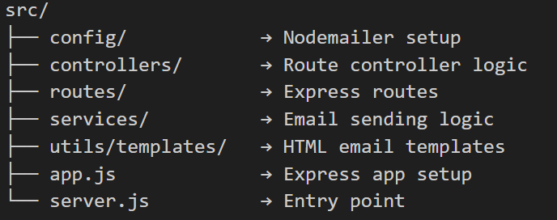

## 📝 **GitHub Repository Comment (Short Version)**

```
🚀 A production-ready Node.js + Express email service using Nodemailer.
📧 Sends beautiful HTML welcome emails with modular folder structure.
Perfect base for signup, password reset, or notification mail systems.
```

---

## 💎 **Top-of-File Comment for `server.js`**

```js
/**
 * 🚀 Node.js + Express Email Service using Nodemailer
 * ---------------------------------------------------
 * Author: Reja
 * Description:
 * A clean, modular, and scalable backend setup for sending transactional emails.
 * Includes:
 *   ✅ Express API endpoint for sending welcome emails
 *   ✅ Reusable mail service and HTML template
 *   ✅ Environment-based configuration for security
 *   ✅ Production-ready folder structure for future expansion
 *
 * Ideal for:
 *   - Sending Welcome Emails
 *   - Password Reset Links
 *   - Email Verification
 *   - System Notifications
 *
 * Usage:
 *   1️⃣  POST → /api/mail/sendMail
 *   2️⃣  Body → { "email": "user@example.com", "username": "Nasim" }
 *
 * Result:
 *   ✉️ Sends a professional HTML Welcome Mail instantly!
 */
```

---

## 🧾 **README.md (Full Professional Version)**

```md
# 📧 Nodemailer Email Service (Express + Node.js)

A **production-ready email service** built using **Node.js**, **Express**, and **Nodemailer**.  
This project follows a clean, scalable folder structure and supports sending professional **HTML emails** — perfect for **welcome messages**, **password resets**, and **email verifications**.

---

## 🚀 Features
- 🧩 Modular architecture (config, controller, service, routes)
- 💌 Beautiful HTML email templates
- 🔐 Secure credentials via `.env`
- 🧠 Easy to integrate with any signup system
- 🧱 Built with Express.js and Nodemailer
- ⚙️ Ready for Gmail or Mailtrap setup

---

## 🗂️ Folder Structure
```




## Installation & Setup

```bash
git clone https://github.com/
cd nodemailer-server
npm install
````

Create a `.env` file:

```env
PORT=5000
EMAIL_USER=your_email@example.com
EMAIL_PASS=your_app_password
```

Run the server:

```bash
node src/server.js,
nodemon src/index.js

```

---

## 📬 API Endpoint

**POST:** `/api/mail/sendMail`

**Request Body:**

```json
{
  "email": "user@gmail.com"
}
```

**Response:**

```json
{
  "success": true,
  "message": "Welcome mail sent!"
}
```

---

## 🧠 Example Use Cases

* Send welcome email on new signup
* Trigger email verification
* Send password reset link
* Notify users about updates

---
